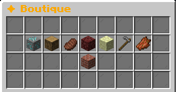
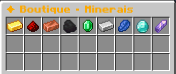
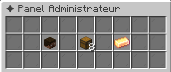
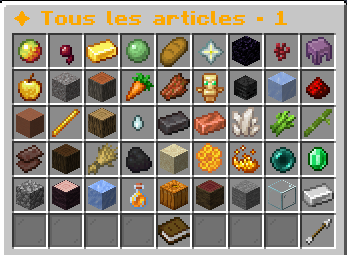
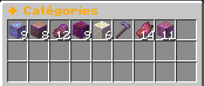
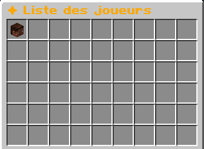

# BasicEconomy

BasicEconomy est un plugin d’économie simple, moderne et intuitif pour serveurs Minecraft (Paper/Spigot), permettant de gérer facilement un système de monnaie, un shop dynamique et l’administration des joueurs.

---

## ✨ Fonctionnalités

### 💰 Système d'économie
- Gestion de balance par joueur
- Ajout / retrait / définition de balance
- Sauvegarde automatique

---

### 🛒 Shop dynamique
- Achat et vente d’objets via interface GUI
- Prix d’achat et de vente configurables
- Prix dynamiques selon l’offre et la demande
- Activation / désactivation d’articles
- Recherche rapide avec `/shop search <item>`

Exemple :
```bash
/shop search diamond
```

---

### 📦 Catégories
- Minerais
- Bois
- Nourriture
- Nether
- End

Navigation intuitive via GUI.

---

### 🛠 Panel administrateur
Interface dédiée pour :
- consulter les balances joueurs
- modifier les balances
- modifier les prix des articles
- activer/désactiver des articles
- voir toutes les catégories

---

### 🔍 Recherche intelligente
Recherche partielle supportée :

```bash
/shop search dia
```

Résultat :
- Diamond
- Diamond Block
- Diamond Ore

Chaque résultat est :
- cliquable
- avec aperçu via hover

---

## 📋 Commandes

| Commande              | Description |
|-----------------------|-------------|
| `/shop`               | Ouvre le shop |
| `/shop search <item>` | Recherche un article |
| `/panel`              | Ouvre le panel admin |

---

## 📷 Aperçu

### Shop
GUI moderne avec catégories et achat/vente rapide.




### Admin
Gestion complète via interface graphique.






---

## ⚙️ Compatibilité

- Java 21+
- Paper 1.21+
- Spigot (partiellement supporté)

---

## 📦 Installation

1. Télécharger le `.jar`
2. Placer dans `plugins/`
3. Redémarrer le serveur
4. Configurer selon vos besoins

---

## 🚀 À venir
- Base de données MySQL
- PlaceholderAPI
- Historique des transactions
- Logs admin
- API publique

---

## 👨‍💻 Auteur

Développé par **Tablelkea**

GitHub :
https://github.com/Tablelkea

---

## 📜 Licence

Projet open-source sous licence MIT.